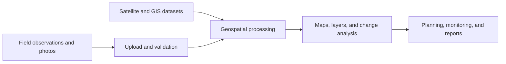

# Jalsetu Flutter App Build Report

**Prepared:** 2026-10-03  
**Purpose:** Turn the supplied Jalsetu concept PDF into an actionable product and implementation plan.

## Executive Summary

Jalsetu is a watershed monitoring and decision-support platform. Its core workflow combines field observations and geo-tagged photographs with satellite data and GIS layers, then presents thematic maps and change information to planners and administrators.

The current project is an unmodified Flutter counter starter: `lib/main.dart` contains the demo counter, and `pubspec.yaml` has no mapping, networking, storage, or state-management dependencies. Build Flutter as the field-collection app, backed by geospatial services for data management and analysis. Provide planners and administrators with a web GIS dashboard as well; raster processing and watershed analysis should not run on mobile devices.

## Product Scope

The PDF identifies these user groups:

- **Field teams:** collect observations and geo-coded images.
- **Watershed planners:** explore conditions, maps, and evidence.
- **Administrators and monitoring teams:** track interventions, compare changes, and prepare reports.
- **Watershed programs:** monitor large areas and assess progress consistently.

The intended workflow is:



## Feature Requirements

### Field collection app

- Sign-in and role-based access.
- Select or search a watershed, program, or assigned survey area.
- Capture photos with coordinates, timestamp, author, and optional notes.
- Record structured observations, intervention type, condition, and status.
- Display GPS accuracy and warn when the location is unavailable or imprecise.
- Save drafts offline and queue uploads until connectivity returns.
- Review, edit, and submit observations; show upload and validation status.
- Preserve original media metadata where permitted and record the location source and accuracy.

### Watershed map and data viewer

- Show watershed boundaries, field observations, interventions, and geo-tagged photos.
- Toggle land-use/land-cover, drainage, vegetation, water-body, intervention, and change layers.
- Show legends, layer metadata, date range, source, resolution, and attribution.
- Filter by watershed, date, observation type, intervention status, and area.
- Select map features to inspect attributes and linked photographs.
- Compare field evidence with thematic and satellite layers.
- Support map navigation and location search.

### Mapping, analysis, and monitoring

- Display thematic maps produced by backend GIS workflows.
- Support spatial overlays and watershed-boundary analysis.
- Compare selected time periods for land, vegetation, and water-resource changes.
- Track intervention locations, implementation status, and evidence.
- Summarize observations, coverage, and changes by watershed or program.
- Highlight data gaps, stale layers, and observations requiring review.
- Generate map exports and downloadable monitoring reports.
- Record an audit trail for changes to observations and analytical outputs.
- Treat AI image interpretation and automated change detection as later capabilities that require validation.

## Recommended Architecture

| Component | Responsibility | Recommended direction |
|---|---|---|
| Flutter mobile app | Field collection, map viewing, offline capture and sync | Feature-based Flutter app with local storage and queued uploads |
| Web GIS dashboard | Administration, analysis review, reporting | Dedicated responsive web GIS experience for planners and administrators |
| REST API | Authentication, projects, observations, photos, layers, reports | Python API, for example FastAPI |
| Spatial database | Watersheds, points, boundaries, spatial queries | PostgreSQL with PostGIS |
| File storage | Photos, source imagery, generated exports | Object storage; retain metadata and references in the database |
| Processing workers | Raster preparation, overlays, thematic maps, change analysis | Asynchronous GIS jobs using tools such as GDAL and established GIS workflows |
| Map delivery | Rendered and queryable spatial layers | Publish tiled or standards-based map services; keep provider credentials server-side |

Flutter should capture and display geospatial data. Heavy raster processing, classification, and change detection should run in backend jobs or established GIS workflows. The mobile client should request prepared layers and analysis results through the API or map services.

## Suggested Flutter Structure

```text
lib/
  app/
    app.dart
    router.dart
  core/
    api/
    auth/
    database/
    location/
    sync/
  features/
    field_observations/
    map_viewer/
    watersheds/
    interventions/
    reports/
```

Keep screens separate from API and local-storage details through repositories. Treat authentication, observations, map layers, offline synchronization, and reporting as separate feature areas. Choose specific Flutter packages after confirming supported platforms, licensing, current maintenance, and compatibility with the project's Dart/Flutter SDK.

## Data and API Design

Core records should include:

- **Watershed:** name, boundary reference, administrative area.
- **Observation:** location, timestamp, author, category, notes, status, GPS accuracy.
- **Photo:** storage reference, capture time, coordinates, upload status, observation link.
- **Intervention:** type, location or geometry, implementation status, dates, evidence.
- **Layer:** title, type, extent, date range, source, resolution, attribution, processing status.

Example API operations:

```text
POST /observations
POST /observations/{id}/photos
GET  /watersheds/{id}/layers
GET  /observations?watershed_id=...&from=...&to=...
GET  /interventions?watershed_id=...
POST /analysis/change-detection
GET  /reports/{id}
```

Validate coordinates, permissions, required fields, file types, and upload size at the API boundary. Make uploads retryable and design synchronization for duplicate requests and conflicting edits. Field connectivity may be unreliable.

## Phased Delivery Plan

1. **Confirm requirements and data access.** Identify target users, roles, workflows, satellite provider, data licensing, coverage, GIS files, and required reports.
2. **Build an app shell.** Implement navigation, sign-in flow, watershed selection, and a map using sample data.
3. **Deliver field collection.** Add forms, photo capture, GPS metadata, local drafts, and upload queue.
4. **Connect spatial services.** Add the API, PostGIS, file storage, watershed boundaries, and layer metadata.
5. **Add map and monitoring features.** Implement layer controls, filters, feature details, photo viewing, and intervention tracking.
6. **Add validated analysis and reports.** Publish backend-produced thematic layers and time comparisons; review results with GIS specialists and field evidence.
7. **Pilot and harden.** Test offline use, inaccurate GPS, large uploads, permissions, device compatibility, and recovery before wider deployment.

For an early demonstration, use sample or pre-generated thematic layers. Clearly label mock data and do not present simulated change detection as a validated result.

## Risks and Open Decisions

- The PDF mentions **SRISHTI-DRISHTI** and **30 m** satellite resolution. Confirm the exact dataset, provider, coverage, update frequency, access method, licensing, and suitability before implementation. A 30 m dataset may not resolve small field-level structures.
- Photo quality, missing GPS, and inconsistent survey practices can reduce analytical reliability. Validate submissions and retain data provenance.
- Satellite and GIS processing may be expensive or slow. Run it asynchronously and show whether results are pending, current, or stale.
- Offline support needs explicit retry and conflict behavior; local drafts must not disappear silently.
- Geo-tagged photos may expose sensitive locations or personal information. Define consent, access control, retention, and export rules.
- Every map and analytical output should expose its source and limitations. Decision-support results should not imply certainty beyond the underlying data.

## Acceptance Checklist

- A field user can create an observation and attach a geo-tagged photo.
- Drafts survive app restarts and sync after connectivity returns.
- Planners can filter observations and inspect their mapped locations and photos.
- Authorized users can view required thematic layers and their metadata.
- Analysis results identify source, date, resolution, and limitations.
- Reports can be generated from the same records shown in the map.
- Tests cover form validation, local persistence, sync retries, API errors, and map-layer states.

## Research Notes and References

The product requirements in this report are taken from the supplied Jalsetu PDF. The PDF's satellite-source and resolution claims have not been independently verified here. Live web research was not available while preparing this report; the official documentation links below are starting points for technical evaluation, not confirmation that a specific provider or integration has been selected.

- [Flutter app architecture](https://docs.flutter.dev/app-architecture)
- [Flutter offline-first guidance](https://docs.flutter.dev/app-architecture/design-patterns/offline-first)
- [Flutter testing](https://docs.flutter.dev/testing)
- [PostGIS documentation](https://postgis.net/documentation/)
- [FastAPI documentation](https://fastapi.tiangolo.com/)
- [GDAL documentation](https://gdal.org/)
- [OGC API Features](https://ogcapi.ogc.org/features/)
- [GeoServer documentation](https://docs.geoserver.org/)
- [Jalsetu repository cited in the PDF](https://github.com/SIH-Lakshya/Jalsetu-of-Lakshya-01)